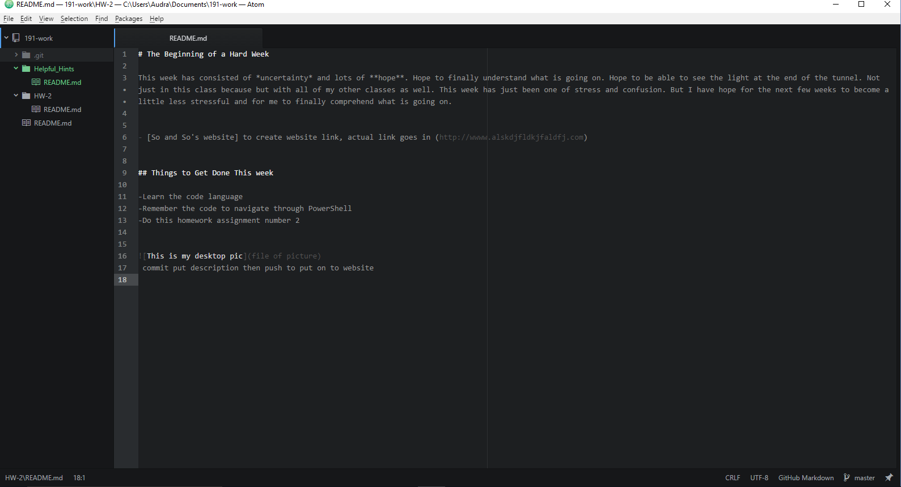

# The Beginning of a Hard Week

This week has consisted of *uncertainty* and lots of **hope**. Uncertainty of how this assignment is going to end up because I am not 100 percent positive as to what is going on but I'm still going on. Hope to finally understand what is going on. Hope to be able to see the light at the end of the tunnel. Not just in this class but with all of my other classes as well. This week has just been one of stress and confusion from one class to the next. But I have hope for the next few weeks to become a little less stressful and for me to finally comprehend what is going on.

- [Google Images Cats](https://www.google.com/search?q=cats&espv=2&biw=1600&bih=794&site=webhp&source=lnms&tbm=isch&sa=X&ved=0ahUKEwitqujN0PrRAhXC6IMKHVK8CRkQ_AUIBigB)

## Things to Get Done This week

- Learn the code language
- Remember the code to navigate through PowerShell
- Do homework assignment number 2

## The Screenshot

